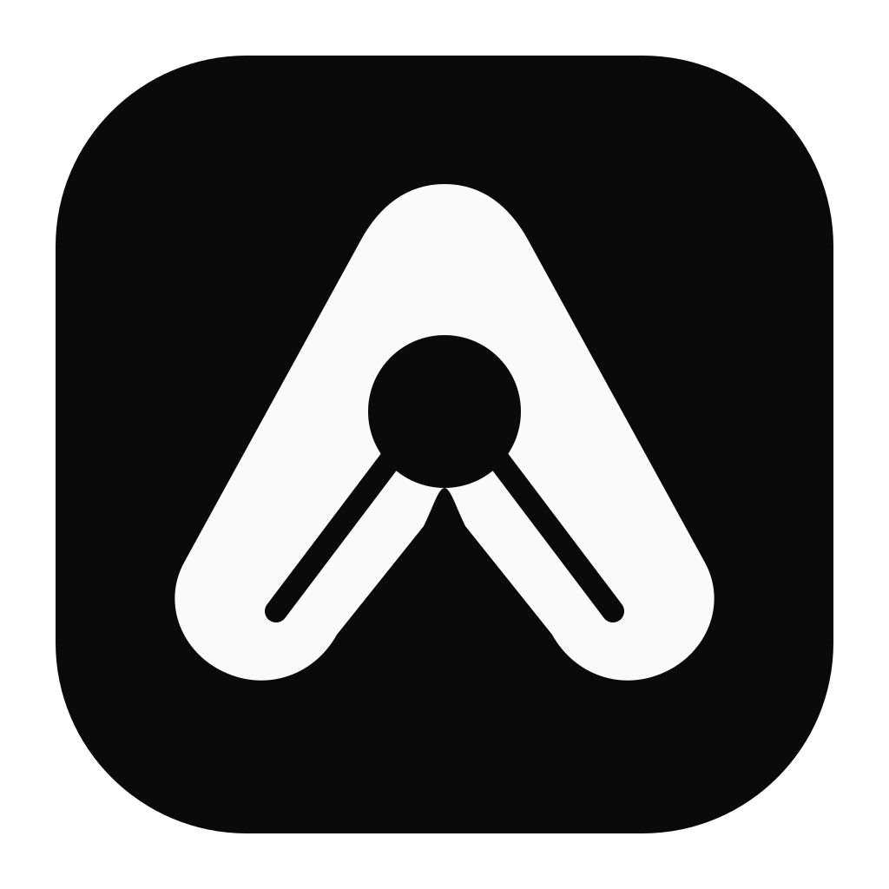
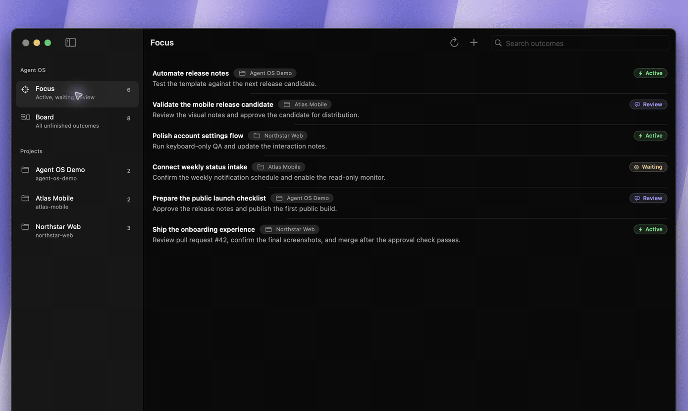

#  Agent OS

**A local-first Codex task board, MCP plugin, and native macOS app for managing
AI-agent work across multiple projects.**

Agent OS gives OpenAI Codex work a durable, cross-project control plane. It
combines a visual task board, a durable Done workflow with exact-linked outcome
time, project routing, exact Codex task correlation,
pull-request and source context, optional read-only intake, and installable
plugins in one portable setup.

## Why Agent OS?

Long-running Codex work becomes difficult to track when outcomes, project
routing, pull requests, source links, time, and follow-up tasks are spread
across separate chats. Agent OS keeps that operational context local and makes
it visible through a native macOS task board and MCP tools.

Agent OS does not replace your project repositories, GitHub, Slack, or Codex.
It gives those systems a small, deterministic continuity layer without copying
transcripts or introducing another hosted task database.

Repositories are optional for Slack-only coordination. An actionable request
from a named Slack channel can become an unassigned inbox outcome with a
display-only channel label, so managers and client-facing users can organize
work without creating fake Git projects. Slack source cards can also show one
short root-message excerpt instead of the generic `Slack thread` title; the
exact permalink remains the source identity.



## Installation

Requirements: Codex desktop or CLI with plugin support, Ruby, and Node.js. The
downloadable macOS app supports Apple Silicon (`arm64`) on macOS 14 or newer;
an Intel or universal binary is not included yet.

```bash
codex plugin marketplace add andrewgolovanov/agent-os --ref v0.4.0
codex plugin add agent-os@agent-os
```

Install the matching Agent OS app from the same GitHub Release. The first
component you open bootstraps the bundled runtime and private state in
`~/.agent-os`; there is no repository to clone or source path to configure.
Codex manages its plugin snapshot. Start a fresh Codex task after installing or
updating the plugin so the MCP tools, skills, and hooks are loaded.

Open any existing Git repository from any folder in Codex and ask:

```text
Onboard this repository into Agent OS safely.
```

The plugin previews the registry change before applying it. Every project is
registered at its existing Git root, regardless of where that folder lives.
Agent OS does not create a second project folder or move, copy, rename, commit,
or otherwise modify the project repository. If unfinished Slack-only work has
a conservatively matching channel, onboarding may suggest it without selecting
it. A second preview with exact reviewed channel IDs is required before Agent
OS stores the mapping or attributes previously unassigned work; channel labels
remain visible on task cards.
If the user later moves a registered repository, ask Agent OS to relink that
project. The plugin verifies repository identity and previews only the private
path metadata that will change.
See the complete [installation guide](docs/installation.md), including the
macOS Gatekeeper flow and development-source setup.

## Source and private state

The checkout contains reusable product source:

```text
agent-os/
├── apps/agent-os/              optional native macOS app
├── bin/agent-os                setup, migrate, doctor, update, validate, publication audit
├── config/examples/            sanitized configuration templates
├── docs/                       architecture and runbooks
├── lib/ and tools/             deterministic control plane
├── plugins/                    Agent OS Codex plugin, including Context Loop
└── test/                       isolated and clean-home verification
```

Each user's private home owns `config/*.yaml`, `work/`, `.runtime/`, and a
pointer to the selected packaged runtime. Registered project repositories
remain wherever the user already keeps them; Agent OS stores their paths but
does not copy their code. Private tasks, provider
identifiers, and repository paths never belong in a release candidate.

## Codex plugin

The installed plugin contains its own minimal Agent OS runtime. On first use it
creates or repairs the private home, then exposes Task Board and project
onboarding through MCP. No manually managed Agent OS checkout is required.

The source plugin also contains the Context Loop skill, Task Bridge hooks, and
the `setup-agent-os` skill. Use `$context-loop` when one long-running task needs
repository-backed checkpoints that survive compaction or a new session. Review
hook commands with `/hooks`, start a fresh task, and ask `Set up optional Agent
OS integrations safely.` Slack and recurring monitoring remain separate
opt-ins; see [Optional integrations](docs/optional-integrations.md).

The local Slack monitor configuration remains preview-first. Ask the plugin to
set up optional integrations; it resolves the packaged runtime and shows every
local mutation before applying it.
When no repository is registered, the Scheduled monitor can use the active
Agent OS home as a non-version-controlled local project. Slack channel labels
remain separate from repository-backed project routing. Once a channel is
explicitly mapped to a registered project, its label stays on task cards but no
longer appears as a duplicate top-level sidebar filter.

Plugin updates come from versioned marketplace snapshots. The native app uses
signed Sparkle release archives. A development checkout keeps the older
preview-first Git update path and is never overwritten when the packaged
runtime bootstraps.

An older development installation that used one directory for both source and
private state can be separated without losing its registry or Task Board. Use
the preview-first `agent-os migrate-home` command from the development checkout;
the old home remains untouched until the migrated copy has been verified.

## Optional macOS app

The app owns no database. Its bundle contains the same minimal runtime as the
plugin, initializes `~/.agent-os` when needed, reads the private registry, and
invokes the packaged `tools/task-board` executable with argument arrays.
Focus and Board keep current work actionable. Done retains completed and
cancelled outcomes with their context, source links, PR state, Codex membership,
tracked time, and explicit completion follow-up. Its project, period, lifecycle,
and follow-up filters keep the completion journal useful without a separate
time-only navigation surface. The broader generated Project Time ledger remains
available through the CLI for reporting across all project chats.

For a release artifact, run `./script/package_release.sh`. It creates an ad-hoc
signed zip, SHA-256 checksum, and Sparkle appcast without Developer ID or
notarization. The app checks releases automatically, notifies by default, and
offers opt-in automatic install. macOS will block the first launch until the
user explicitly approves the app in Privacy & Security; see the installation
guide for the exact flow and update trust boundary.

## Safety and publication

Integrations are opt-in and read-only by default. Initialization does not enable
hooks, schedules, Slack access, repository writes, commits, pushes, or deploys.
Plugin installation makes its hook bundle available, but Codex still requires
the user to review trust with `/hooks`; the Slack connection and Scheduled task
remain separately controlled product state.

Before publishing a candidate, run:

```bash
./bin/agent-os audit-publication
```

The audit is a release gate for known private paths, provider identities,
client-specific history, Codex task IDs, and obvious credential material. It
complements, but does not replace, a dedicated secret scanner and manual review.

See [installation](docs/installation.md), [the documentation map](docs/README.md), [Agent OS distribution](docs/agent-os.md),
and [the security policy](SECURITY.md).

## Contributing

Contributors and local developers still work from a source checkout:

```bash
git clone https://github.com/andrewgolovanov/agent-os.git
cd agent-os
./bin/agent-os init --apply
./bin/agent-os activate --apply
./bin/agent-os doctor
```

An explicitly selected valid development checkout takes precedence over the
packaged runtime and is preserved by app/plugin bootstrap.

To deliberately return that private home to an installed packaged runtime,
preview and then apply `agent-os bootstrap --replace-source` from the chosen
runtime. This explicit flag prevents an automatic app or plugin launch from
silently replacing a development checkout.

Documentation is part of a complete change. Update the nearest `AGENTS.md` when
agent workflows, commands, paths, validation, or ownership rules change; update
the relevant README when installation, usage, or other user-facing behavior
changes. Material product changes must also update their owning document,
`docs/state.md`, and `docs/changelog.md`. Before handoff, search for stale
renamed or removed identifiers and run every documented validation command that
was changed. Only affected documents should be edited—there is no requirement
to touch every README or instruction file mechanically.

## License

MIT
