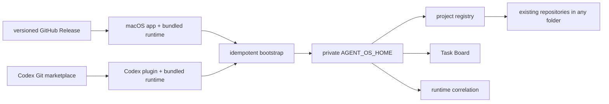

# Agent OS distribution

Status: public source and `v0.5.0` checkout-independent release published

Remote policy: public source on `main`; automatic updates only from signed
semantic-version GitHub Releases

License: MIT

## Product boundary

Agent OS is the portable product form of the local control plane. A clean user
must be able to install it without receiving another person's project paths,
tasks, provider identifiers, credentials, runtime cursors, or client history.

Normal users do not manage a source checkout. Codex owns its installed plugin
snapshot; the app owns its packaged resources; both select a minimal versioned
runtime and share `~/.agent-os` by default. A valid explicitly selected
development checkout remains supported and is never replaced by packaged
bootstrap.

## Approved decisions

- The plugin and app each ship the same synchronized minimal runtime, so either
  component can initialize a clean private home without a manual clone.
- A source checkout is a development and contribution surface, not a runtime
  prerequisite for packaged users.
- Core, the Agent OS macOS app, and one Agent OS plugin live in one monorepo;
  Context Loop is a focused skill inside that plugin.
- The obsolete standalone Context Loop plugin is no longer a product package;
  Context Loop is distributed as a skill inside the single Agent OS plugin.
  Any external recovery copies are local migration artifacts, not product
  source or part of the installation contract.
- Real configs, outcomes, reports, runtime pointers, and project paths are
  private local state and are ignored by the product repository. Project
  repositories remain in their existing locations.
- The source repository is public after the initial secret scan, manual review,
  and clean-clone validation gates passed.
- The initial license is MIT.

## Implemented stage 1

- `AGENT_OS_SOURCE_ROOT` and `AGENT_OS_HOME` separate executable source from
  mutable local state; legacy one-root variables remain compatible.
- App and plugin bootstrap select their bundled runtime, create missing private
  state, and preserve a valid selected development source.
- The app pages public active, non-archived Codex task metadata and passes only
  `cwd` values to the shared runtime; the plugin hook synchronizes the current
  task `cwd` before routing. Both automatically register only deterministic
  eligible Git roots and never import thread bodies or historical tasks.
- MCP project onboarding previews and registers any existing Git repository by
  absolute path without moving or modifying it; the private registry is the
  only Agent OS owner of project routing metadata.
- Onboarding may suggest conservative Slack channel matches, then requires a
  second preview with exact selected channel IDs before it stores mappings or
  assigns unfinished outcomes that have no project. Existing attribution and
  task-card labels are preserved.
- MCP and CLI registry upgrade remove obsolete layout metadata and retain an
  old managed project folder in a private recovery backup.
- MCP and CLI relinking verify repository identity and update only private
  registry paths after the user has physically moved a repository.
- `bin/agent-os init` previews exact targets and preserves every existing file.
- `activate` records the selected home in the standard user config directory so
  app/plugin processes do not need a hard-coded path or shell environment.
- `migrate-home` stages and validates a copy of legacy private state before
  atomically selecting a separate home; repositories remain in place and the
  previous home is preserved for rollback.
- `bootstrap --replace-source` provides a separate preview-first escape hatch
  from an explicitly selected development checkout to a chosen packaged
  runtime; automatic bootstrap continues to preserve development selection.
- `doctor` is read-only; `validate` checks source structure, the selected home,
  Ruby tests, MCP source/home isolation, the plugin package, and Context Loop.
- Sanitized config templates create an empty registry and no enabled monitors.
- `configure-slack-monitor` previews and merges one sanitized read-only monitor
  into the private home without connecting Slack or creating a schedule.
- The Agent OS plugin ships Context Loop, Task Bridge hooks, and setup skills;
  Codex remains the authority for hook trust, the connected Slack integration,
  and Scheduled task state.
- The Agent OS app no longer assumes a developer path and packages the same
  synchronized runtime used by the plugin.
- The Agent OS MCP server confines reads/writes independently to the
  configured source and home roots.
- The app and unified plugin package are consolidated under `apps/` and `plugins/`.
- Local configs, task history, runtime, registered project paths, and source
  pointers are excluded from Git candidates.
- `audit-publication` blocks known private-state patterns before release work.
- `agent-os update` checks semantic release tags and can only fast-forward a
  clean checkout; the plugin refresh follows its manifest version.
- The native app embeds Sparkle, checks a GitHub Release appcast, and verifies
  every archive with the dedicated Agent OS Ed25519 public key.

## Remaining gates

The Sparkle private key has an independently verified encrypted recovery copy,
the matching GitHub Actions secret is configured, and `v0.5.0` is published.
Its public zip, checksum, latest appcast, bundle metadata, architecture,
embedded runtime, and Ed25519 signature passed independent post-publication
verification. A fresh anonymous clone of the tag also initialized and validated
against a separate private home without relying on the development checkout.

1. Complete a user-approved install on a second Mac, then prove a genuine
   `v0.4.3` to `v0.5.0` update.

Public source does not authorize copying private local state, changing unrelated
remotes, or publishing an unsigned release.
