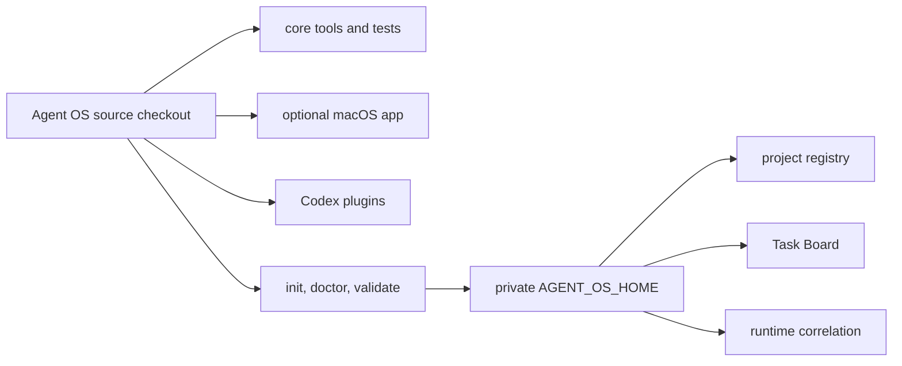

# Agent OS distribution

Status: approved; local stage 1 implemented

Remote policy: private first; no commit or push before all publication gates

License: MIT

## Product boundary

Agent OS is the portable product form of the local control plane. A clean user
must be able to install it without receiving another person's project paths,
tasks, provider identifiers, credentials, runtime cursors, or client history.

The source checkout and private home may be the same directory for a migrated
installation, but their contracts remain separate. New installations default
to `~/.agent-os` for private state.

## Approved decisions

- The existing control-plane checkout becomes the in-place Agent OS source.
- Core, the Agent OS macOS app, the Agent OS plugin, and optional Context
  Loop live in one monorepo.
- Existing standalone app/plugin directories remain untouched as recoverable
  local backups until the monorepo is published and adopted.
- Real configs, outcomes, reports, runtime, and project checkouts are private
  local state and are ignored by the product repository.
- The first remote stage remains private.
- The initial license is MIT.

## Implemented stage 1

- `AGENT_OS_SOURCE_ROOT` and `AGENT_OS_HOME` separate executable source from
  mutable local state; legacy one-root variables remain compatible.
- `bin/agent-os init` previews exact targets and preserves every existing file.
- `activate` records the selected home in the standard user config directory so
  app/plugin processes do not need a hard-coded path or shell environment.
- `doctor` is read-only; `validate` checks source structure, the selected home,
  Ruby tests, MCP source/home isolation, both plugin manifests, and Context Loop.
- Sanitized config templates create an empty registry and no enabled monitors.
- The Agent OS app no longer assumes a developer path and reads the source
  pointer created in the private home.
- The Agent OS MCP server confines reads/writes independently to the
  configured source and home roots.
- The app and both plugin packages are consolidated under `apps/` and `plugins/`.
- Local configs, task history, runtime, project checkouts, and source pointers
  are excluded from Git candidates.
- `audit-publication` blocks known private-state patterns before release work.
- `agent-os update` checks semantic release tags and can only fast-forward a
  clean checkout; the plugin refresh follows its manifest version.
- the native app embeds Sparkle, checks a GitHub Release appcast, and verifies
  every archive with the dedicated Agent OS Ed25519 public key.

## Remaining gates

1. Run a dedicated secret scan and manually review every candidate file.
2. Validate plugin pickup in a fresh Codex task from the monorepo marketplace.
3. Configure the private remote only after those checks; then create and review
   the first commit before any push.
4. Consider public visibility only after a second person completes setup without
   developer-specific intervention.
5. Back up the Sparkle private key, configure the GitHub Actions secret, and
   prove a real `v0.1.0` → later-version update on a second Mac.

Approval does not authorize making the repository public, copying private local
state, changing unrelated remotes, or publishing a release.
